# UF4_M06_PRACTICA_1
### Aquesta pràctica consisteix en fer una aplicació web, que utilitzi fast api per a dissenyar els endpoints que permetran fer CRUD sobre la base de dades "botiga". A més hi ha un endpoint dedicat a fer una càrrega massiva des de un fitxer csv.

## CRUD
### Aqui hi ha les evidències del funcionament del CRUD:
### - Mostra tots els productes
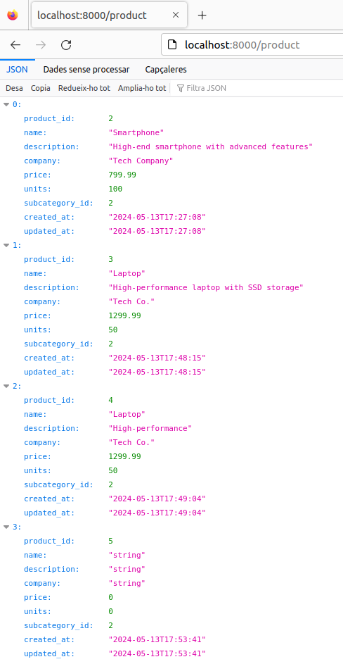

### - Mostra producte per id
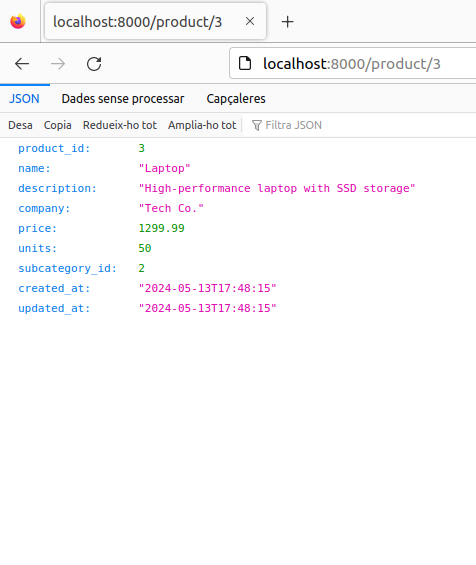

### - Crear un producte
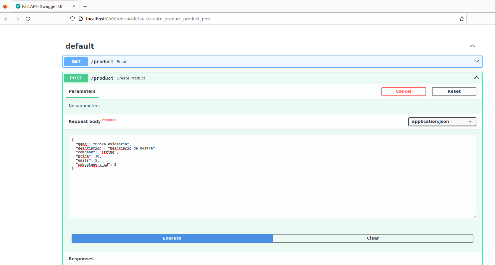
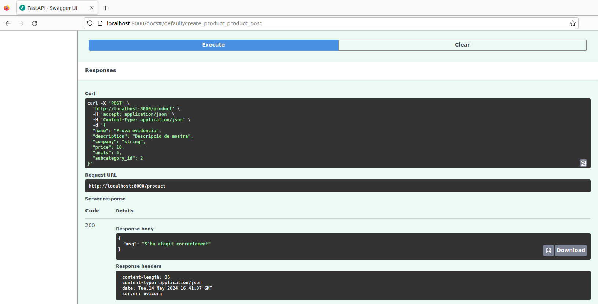

### - Modificar un producte
#### Estat inicial producte:
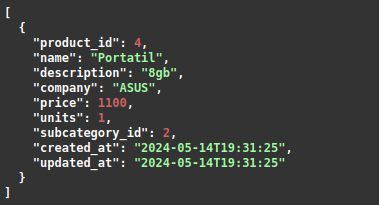
#### Modificació producte:

#### Comprobació:
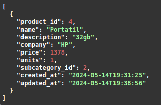

### - Eliminar un producte
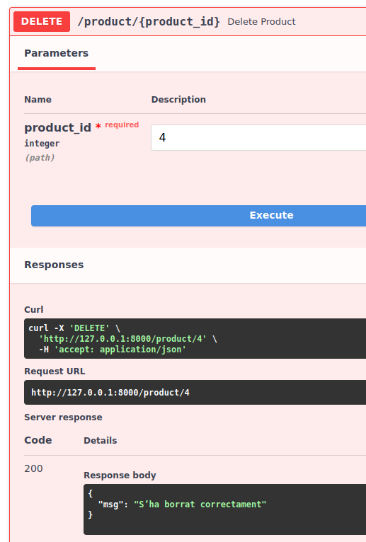
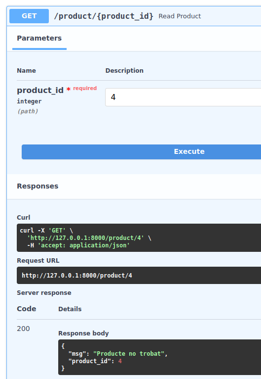

### - Mostrar tots els productes, d'una forma específica.
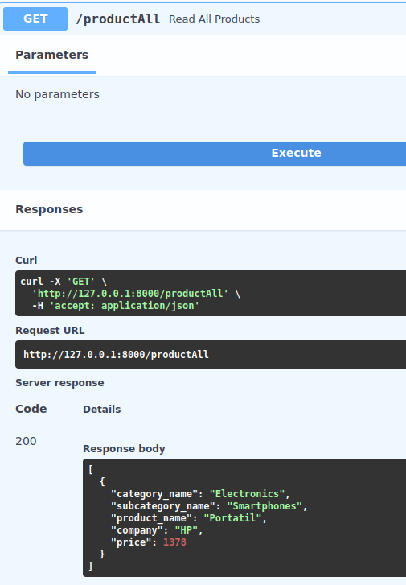

### - Comprobació càrrega massiva des de un fitxer csv
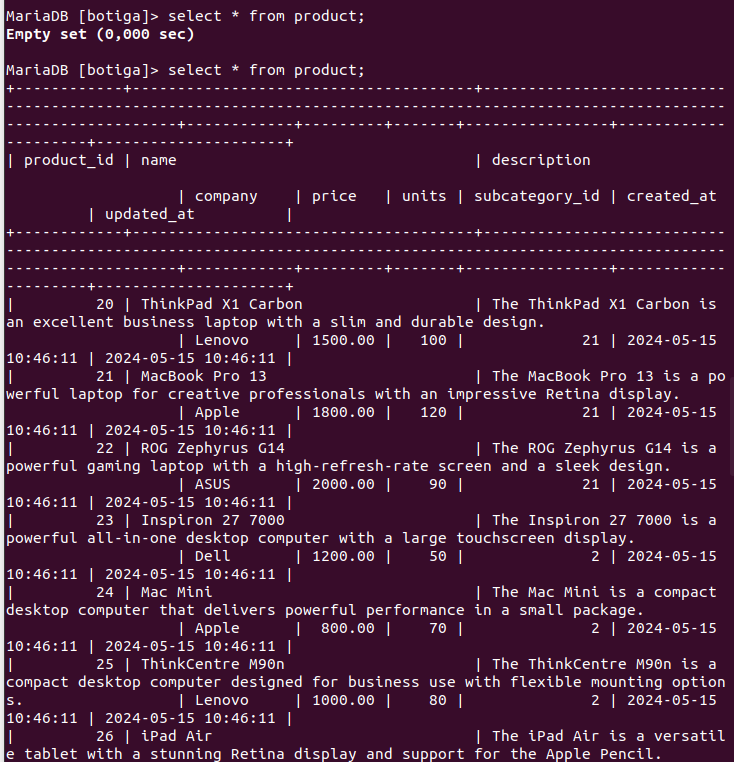
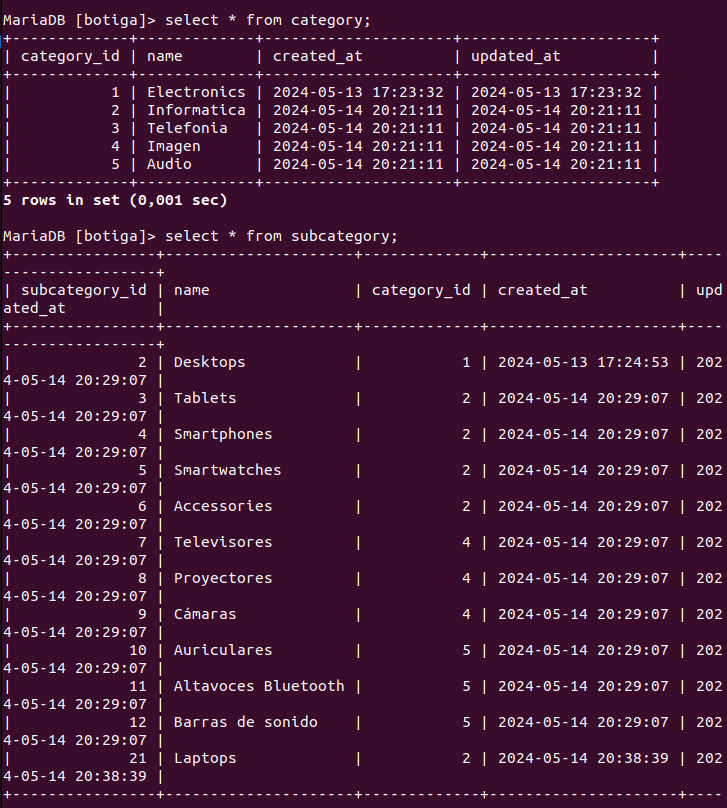

